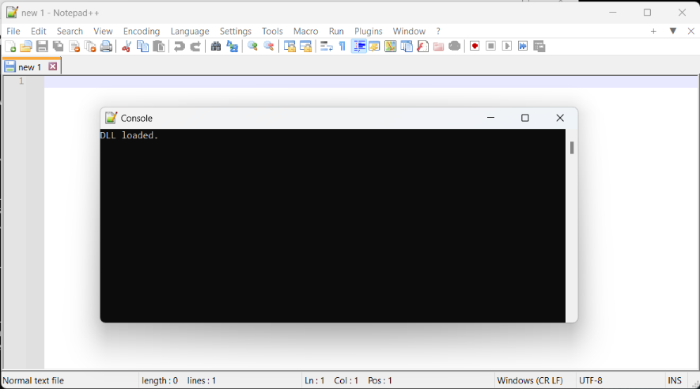
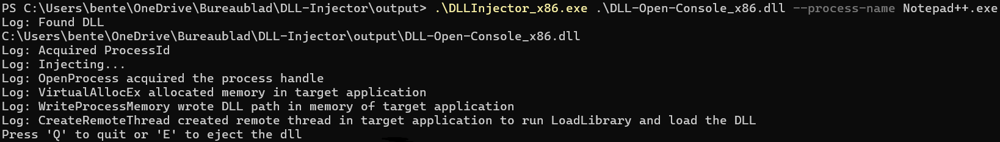
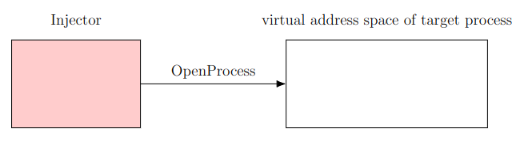
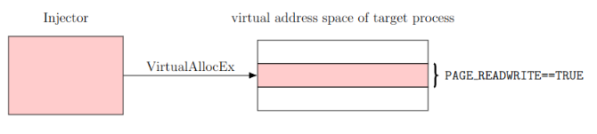
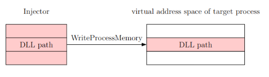
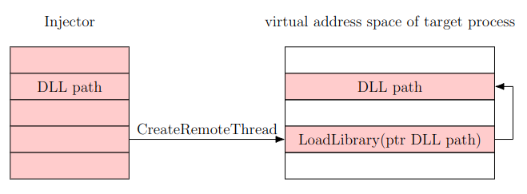
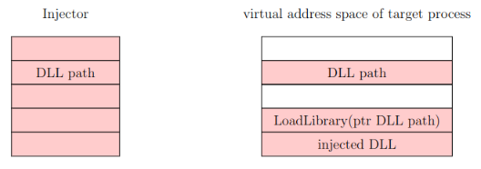

# DLL Injector for Windows (x86/x64)

## Overview

This repository contains a simple DLL (Dynamic Link Library) injector designed for Windows programs, supporting both x86 and x64 architectures. The injector allows you to inject custom DLLs into running processes, enabling you to modify their behavior dynamically.

When this DLL is injected in a target process, it opens a console in the target application.



## Features

- **Cross-Architecture Support:** Able to compile and work with both x86 and x64 Windows programs.
- **Example DLL:** Includes an example DLL to test the injector that opens a console in the target process.
- **Visual Studio Project:** developed using Microsoft Visual Studio

## Usage

Note that the injector, injected DLL and target program should all have the same architecture!

1. **Build the Injector:**
   - Open the `DLLInjector.sln` solution file in Visual Studio.
   - Build the solution for the desired architecture (x86 or x64).

2. **Build or locate the DLL you want to inject:**

3. **Prepare Target Process:**
   - Run the target application you want to inject the DLL into.
   - Identify the target process using the PID, the application name, or the window title

4. **Run the Injector from the command line:**

   ```cmd
   .\DLLInjector_x86.exe .\DLL-Open-Console_x86.dll --process-name Notepad++.exe
   ```

5. **Verify that the DLL is successfully injected:**

The console should give the following output:



6. **Eject the DLL (optional):**
   - Press 'e' to eject

## Injection Process











## License

This project is licensed under the [MIT](LICENSE) license.

## Disclaimer

**This tool is created for educational purposes. Use it responsibly.**
